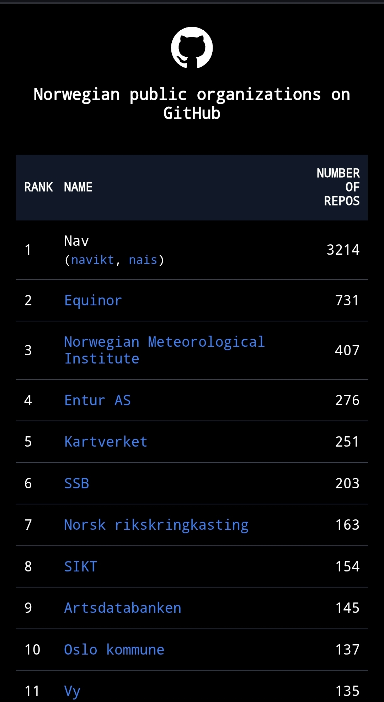

# norwegian-public-organizations


## Technologies used
* Plain HTML, CSS, and JavaScript (static site)
* Node.js (data fetch script)
* GitHub Pages

## How it works
A GitHub Actions workflow runs every hour (and on every push to `main`).
It executes `scripts/fetch-data.js`, which calls the GitHub API to retrieve the
current public repository count for each organisation and generates a fully
pre-rendered `site/index.html` (no JavaScript fetches at runtime). The static
site (`site/`) is then deployed to GitHub Pages.

## Running the data fetch locally
### Prerequisites
* Node.js 20+

Set a GitHub token so you don't hit the unauthenticated rate limit:
```bash
export GH_TOKEN='your_github_token'
```

Fetch the data:
```bash
node scripts/fetch-data.js
```

This writes `site/index.html`. Open it in a browser to view the result.

## Deployed to GitHub Pages
The application is live at: https://mikaojk.github.io/norwegian-public-organizations/

## Organization is missing!!
Follow the guide in the: [CONTRIBUTING.md](CONTRIBUTING.md)
and append the organization in this file: `site/organizations.json`
